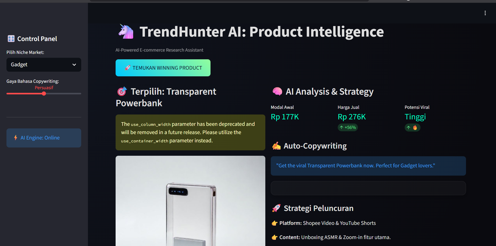

# 🦄 TrendHunter AI: Predictive & Generative E-commerce Intelligence

TrendHunter AI adalah asisten bisnis cerdas yang membantu reseller E-commerce menemukan "Winning Product" berikutnya sebelum viral, lengkap dengan materi promosi yang dibuat otomatis oleh AI.

## 🚀 Tampilan Dashboard

## 🎯 Fitur Unggulan
- **Mesin Prediktif:** Menganalisis data tren (simulasi Google Trends) untuk mengidentifikasi produk yang sedang naik daun.
- **AI Image Generation:** Menggunakan Stable Diffusion API untuk membuat contoh foto katalog produk yang realistis secara otomatis.
- **AI Copywriting:** Menggunakan model bahasa GPT-2 untuk menulis deskripsi produk (copywriting) yang persuasif.
- **Business Intelligence:** Memberikan saran strategi spesifik, seperti jumlah foto katalog, angle foto, dan platform penjualan yang efektif.

## 🛠️ Teknologi
- Python, Streamlit
- Transformers (GPT-2 by HuggingFace)
- Stable Diffusion API (via Pollinations.ai)
- Pytrends (Simulation)
